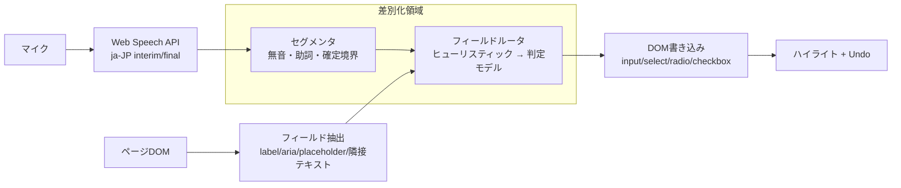

# Prompt

> jev-form という chrome拡張機能をつくりたい。これは、ブラウザに表示されているフォーム要素に、リアルタイムに音声入力で文字入力をしながら、その結果を画面に見えているフォームの適切なところに入力する、みたいなことをやりたい。先に、これをすでに実装してあるものがあるかとか、類似を調査したい。ちょっとでも差別化できるなら作りたい。

# 結論

**4軸すべてを満たす既存プロダクトは見つからなかった → 差別化余地あり。ただし堀は薄い。**

差別化の4軸:

| 軸 | 内容 |
|---|---|
| A | 任意のWebフォーム（Google Forms限定ではない） |
| B | 自然な発話 → 複数フィールドへの自動振り分け（「名前は○○」「次の項目」といったコマンド文法不要） |
| C | ストリーミングでリアルタイム配置（push-to-talk → 一括処理ではない） |
| D | 日本語 |

堀が薄い理由: Voice In（実質デファクト、50+言語・日本語対応）が振り分けを足す、または Chrome 組み込みの "Find and fill with Gemini" が音声を足せば消える。**日本語ファースト + 速さ**で先に出す価値。

# 競合マトリクス

| プロダクト | A 任意フォーム | B 自然発話→振り分け | C リアルタイム | D 日本語 | 規模 / 備考 |
|---|---|---|---|---|---|
| Voice In (Dictanote) | ○ | ✗ フォーカス中の1欄のみ | ○ | ○ | Web Speech API。最大手。AIクリーンアップなし |
| Voicy / BlabbyAI / SpeechOS / VoxWrite | ○ | ✗ 1欄のみ | △ Whisper系は発話単位 | ○ | AI整形あり。振り分けはしない |
| Speech Recognition Anywhere | ○ | ✗ 「次の欄」等の音声コマンド | ○ | ○ 21言語 | 30k users, ★3.8。AIなし。**現行の直接競合** |
| VoiceForm (GitHub Shrutit051) | ○ | △ `"Name is Shruti"` コマンド文法。label/placeholder/name 一致 | ○ | ✗ en | ★0。要ローカルサーバ。ラベルなし欄は不可 |
| VoiceFill AI (GitHub aswin6373) | ✗ Google Forms限定 | ○ Groq Llama 3.3 / Gemini。不足欄は追加質問 | ✗ 無音検知で発話を確定→LLMへ（ターン制） | 未記載 | ★0。MV3。interimResults は表示のみ、配置は発話終了後 |
| web-pa "Browser AI" (GitHub) | ○ | ○ ヒューリスティック + 任意LLM (Ollama/OpenAI/Anthropic) | ✗ push-to-talk → Whisper → レビュー確認 | 未記載 | ★2, MIT。local-first。設計参考価値あり |
| AgentFillAI (Web Store) | ○ | ？ 「speak naturally」と謳うが詳細不明 | ？ | 入力は多言語、**出力は英語のみ** | 23 users, ★0, BYOK OpenAI。検証不能 |
| Anput（個人開発, Zenn） | ○ | ○ Gemini 1.5 Pro | ✗ テキスト/PDF入力、音声なし | ○ | 有料SaaS。**フォーム抽出の知見が有用**（後述） |
| AutoFormFiller / ai-autofill (GitHub) | ○ | ○ LLM | ✗ 音声なし | - | 文書→フォーム系 |
| ChromePilot | ○ | ✗ 音声は1欄dictation。複数欄はドキュメント→エージェント | ○ | - | $49 lifetime, BYOK Gemini。音声と振り分けが別機能 |
| Chrome 内蔵 "Find and fill with Gemini" / Gemini Agent | ○ | ○ Gmail/Photos からデータ取得 | ✗ 音声なし | - | Canary/flags 段階（2026-06〜07）。**最大の将来リスク** |
| Wispr Flow / Aqua Voice / Typeless / Superwhisper | ○ (OS全体) | ✗ 1欄 | ○ | ○ | OSレベル。フォーム構造は見ない |
| AmiVoice / ハナスト / CareViewer | ✗ 専用アプリ | ○ 介護・医療用語辞書 | △ | ○ | 垂直統合。汎用ブラウザではない |

# 最も近い3つ

1. **Speech Recognition Anywhere** — 唯一「フォーム移動を音声で」やっている実運用品。ただしコマンド駆動・AIなし。ここを「コマンド不要」で置き換えるのが最短の差別化。
2. **VoiceFill AI** — 発話→LLM→複数欄配置を実装済み。ただし Google Forms 限定、ターン制。ソース（`popup.js`）確認: `rec.interimResults = true` だが interim は表示のみ、無音タイマーで確定後にLLMへ送る。
3. **web-pa** — 汎用フォーム + ヒューリスティック/LLM 二段構え + レビュー確認。push-to-talk。MIT なので DOM→フィールドモデル抽出部分は参考にできる。

# 先人が踏んだ地雷（設計制約として取り込む）

- **ラベル関連付けは multi-hint 必須**（Anput）: `<label for>` だけでは足りず、隣接テキスト・name/placeholder・aria・場合によりスクリーンショットを併用して精度が出た。
- **ヒューリスティック fallback + 任意LLM**（web-pa）: オフライン/低コスト経路を残す。
- **ラベルなし欄は狙えない**（VoiceForm）: 未解決のまま放置すると SPA/自作UIで死ぬ。
- **API キーは拡張に埋めない**（Anput）: BYOK かサーバ経由。サーバを持つと認証・課金で工数3倍になった。
- **jev-form 固有の難所（自前の推測）**:
  - ja-JP の Web Speech interim は句読点・文節境界がない。「どこで区切って振り分けるか」がコア問題。
  - interim ごとに LLM を叩くとコストとフィールドのチラつき。確定単位（無音 / 助詞パターン「〜は」）で区切る設計が必要。
  - 誤配置の取り消し UI（直前の配置を戻す）がないと実用にならない。

# 想定データフロー（差別化ポイント = 破線枠）

# 参考リンク

- Voice In: https://chromewebstore.google.com/detail/voice-in-voice-typing-spe/pjnefijmagpdjfhhkpljicbbpicelgko
- Speech Recognition Anywhere: https://chromewebstore.google.com/detail/speech-recognition-anywhe/kdnnmhpmcakdilnofmllgcigkibjonof
- VoiceFill AI: https://github.com/aswin6373/voicefill-ai-chrome-extension
- VoiceForm: https://github.com/Shrutit051/voiceform
- web-pa: https://github.com/abhijeethrkgadwal/web-pa
- AgentFillAI: https://chromewebstore.google.com/detail/agentfillai/kaaophcgjennohifdegpkmnokplacfib
- Anput 開発記: https://zenn.dev/shingoirie/articles/70088ed5df6ffd
- AutoFormFiller: https://github.com/Talish1234/AutoFormFiller
- ai-autofill: https://github.com/chandrasuda/ai-autofill
- ChromePilot: https://chromepilot.org/
- Chrome "Find and fill with Gemini": https://www.androidauthority.com/find-and-fill-with-gemini-3689348/
- Gemini Agent form-fill fix: https://chromestory.com/2026/06/chromium-gemini-agent-form-filling-fix/
- 比較記事: https://voxwrite.app/blog/best-speech-to-text-chrome-extensions-compared / https://www.blabby.ai/blog/voice-to-text-chrome-extension
- 介護記録音声入力比較: https://fyve.co.jp/ai-advisor/articles/care-voice-input-ai-5

# 追記: Jev (TypeSafe) 前提での既存実装（2026-09-25）

Jev は 2026-09-15 に early access 公開。以降10日で「音声でブラウザ操作」拡張が4本出ているが、**全部コマンド駆動・英語のみ。自由発話の内容を複数フィールドへ振り分けるものはゼロ。**

| リポジトリ | ★ | フォーム入力の形 | リアルタイム | 備考 |
|---|---|---|---|---|
| moritzkremb/jev-voice-browser | 283 | `"type hello into the search box"` 単発コマンド。文字列は regex で切り出した span を verbatim コピー | ○ 単語ごとに Jev へ ~11問（intent / target / text span / complete / is_command / destructive / is_correction）、250–350ms | Node + Playwright。**ストリーミング判定の設計はそのまま参考になる** |
| moritzkremb/voice-browser-extension | - | 同上（MV3版） | ○ ~12問 / 300ms | side panel + service worker + content script。API キーは SW 内。~$0.0002/call |
| dgr8akki/jev-voice | 0 | `"Surname Pahuja"` 型の明示フィールド指定 | △ typing は発話終了待ち | MIT。可視要素100件上限、iframe/closed shadow 非対応 |
| daneknudsen8-maker/jev-voice-control | - | typing/メール作成コマンド | ○ ~220ms | Node proxy。リスクスコア0–3 + 確認ゲート |

TypeSafe 公式 docs / cookbooks にも form-fill・音声・streaming の項目はなし。近いのは function calling（閉集合引数の選択）と pre-parsed value extraction（regex で候補を over-find → Jev が選ぶ → verbatim コピー）。

## jev-form の差別化（Jev 前提で確定）

1. **コマンドではなく「内容」をルーティング**: ユーザーは「山田太郎、電話は090…、住所は…」と*内容だけ*話す。フィールド指定語は不要。既存4本は全て `type X into Y` 文法。
2. **日本語**: 既存は全て英語。ja-JP の interim 境界（助詞「は」「が」、無音）で segment を切る部分が独自。
3. **ホスト非依存コア**: 「フィールド候補 + 発話 segment → Jev 質問 → 配置決定」を純粋関数化し、Chrome 拡張 → React → iOS へ同じコアを移植する。拡張は最初のホストにすぎない。

## Jev の質問設計（叩き台）

state = `{ fields: [{id,label,type,options?,current}], segment: "電話は090…", prev_segment, filled }`

| 質問 | 型 | 用途 |
|---|---|---|
| この segment はどのフィールドの値か（+ `none`） | Choice | ルーティング本体。`none` 必須（雑談・未確定） |
| segment は値として完結しているか | Noul | interim を配置するか待つか |
| 直前の配置の訂正か（「違う、〇〇」） | Noul | Undo/上書き |
| select/radio ならどの option か | Choice | 閉集合は Jev に選ばせる。自由テキストは verbatim |

値の生成は Jev にさせない（「選ぶだけ」原則）。テキストは STT の文字列をそのまま書く。電話・日付・郵便番号は regex で候補 over-find → Jev 選択 → 正規化（pre-parsed extraction cookbook そのまま）。

## 参考リンク（追記分）
- https://github.com/moritzkremb/jev-voice-browser
- https://github.com/moritzkremb/voice-browser-extension
- https://github.com/dgr8akki/jev-voice
- https://github.com/daneknudsen8-maker/jev-voice-control
- https://docs.typesafe.ai/cookbooks/function_calling.md
- https://docs.typesafe.ai/cookbooks/pre_parsed_value_extraction_cookbook.md
