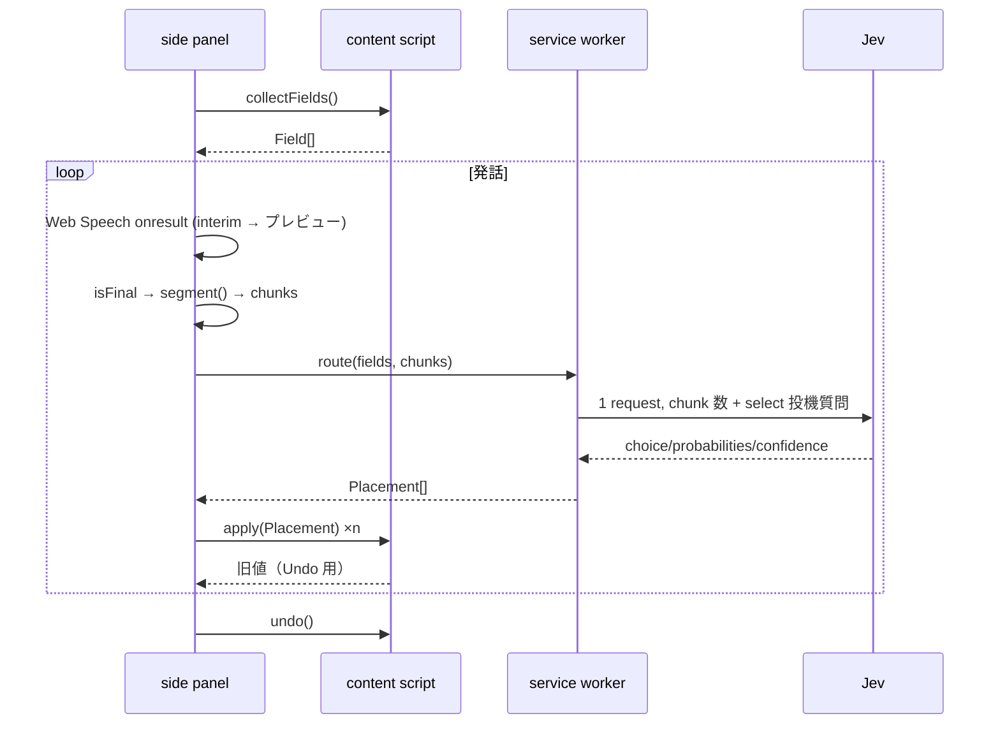

# jev-speakfill 設計 (2026-09-25)

## 目的

話した内容が、画面に見えているフォームの正しい欄にリアルタイムで入る。欄の指定語（「名前は」）は不要。
本命は業務システム（React web / iOS）への組み込み。Chrome 拡張はコアを最速で試す最初のホスト。

成功条件: 任意の日本語フォームで、自由発話が segment 確定ごとに正しい欄へ書かれ、誤配置を1操作で戻せる。

MVP の想定入力（2026-09-25 追記）: 商品情報入力。「赤、革、ルイヴィトン」のように**値だけ**を読点区切りで話す。「色は赤」のような欄名は発話しない（言っても動く）。
音声認識は同音異義を誤変換する（「革」→「川」「皮」）。欄が選択肢を持つ（select/radio/checkbox）なら、文字起こしが「川」でも選択肢「革」が選ばれること。これは MVP 要件。

前提: Jev (TypeSafe System One) は**選ぶだけで生成しない**。値は STT の文字列を verbatim に書く。BYOK。個人情報は自己責任だが最小限の除外は守る。

## 全体構成

```
[side panel]  mic → Web Speech (ja-JP, interim) ─┐
                                                  ▼
[core]  segment() → Chunk[] → route(fields, chunks, ask) → Placement[]
                                                  ▲            │
[content script]  collectFields() ────────────────┘   apply(Placement) / undo
[service worker]  ask(): Jev API 呼び出し（キーはここだけ）
```

パッケージ分割（1リポ・pnpm workspace は不要。ディレクトリのみ）:

- `src/core/` — DOM も mic も知らない。`segment`, `route`, 型。React/iOS へ移植する部分
- `src/ext/` — MV3 拡張。side panel / content script / service worker / options

## core

```ts
type Field = {
  id: string                      // ホストが付ける安定 ID
  label: string                   // label/aria/placeholder/name/隣接テキストを結合したもの
  kind: 'text' | 'select' | 'radio' | 'checkbox'
  options?: string[]              // select/radio/checkbox の表示ラベル
}
type Chunk = { text: string; hint?: string }   // hint = 剥がした欄ラベル語
type Placement = { fieldId: string; value: string; chunk: string; confidence: number }
type JevAsk = (state: unknown, questions: Record<string, Question>) => Promise<Record<string, Answer>>

segment(text: string, isFinal: boolean, fields: Field[]): Chunk[]   // fields は hint（欄ラベル語の剥がし）用
route(fields: Field[], chunks: Chunk[], filled: Record<string,string>, ask: JevAsk): Promise<Placement[]>
```

### segment（コード側、Jev 不使用）

- 入力は Web Speech の結果を連結したテキスト。`isFinal=false` のときは何も返さない（配置は確定時のみ）
- final テキストを以下で chunk に割る: 「、」「。」「,」「 」（空白）、および助詞境界 `〜は` `〜が` `〜で`（直後に値が続く形）
- chunk 先頭が既知の欄ラベル語（`fields[].label` の前方一致、または「電話」「メール」など同義語の小さな表）+「は/が/で」なら、そのラベル語を剥がしてヒントとして保持: `{ text, hint?: string }`
- 空の chunk は捨てる（「赤」「革」など 1 文字の値は MVP 入力なので残す）
- 区切りなし（「赤革ルイヴィトン」「東京都在住の女性です」）は `Intl.Segmenter`（ICU）で単語に割る。助詞・「です」は落とし、隣接するカタカナ同士・ひらがな同士・漢字+ひらがなは戻す。同じ断片由来の語は `glue` 付きで、同じ text 欄に向いたら空白なしで連結（2026-09-25 追記）
- `ponytail:` 助詞ヒューリスティック。境界が誤る日本語が出たら B 案（欄ごとの Noul）を none 時 fallback として追加

### route（Jev 呼び出し）

chunk ごとに1問、全 chunk を1リクエストで並列:

```
state = { fields: [{id,label,kind,options}], chunk: text, hint, filled: {fieldId: value} }
question chunk_i: Choice
  instructions: 「この発話断片はどの入力欄の値か。hint があれば強く考慮。既に filled の欄は上書きの意図が明らかなときだけ」
  criteria: { [field.id]: `${label} (${kind}${options?': '+options.join('/'):''})`, none: '雑談・指示・どの欄でもない' }
```

- `choice === 'none'` または `confidence < 0.35` → 配置しない（side panel に「未配置」表示）
- 欄選択・option 選択の両方の instructions に「これは音声認識の文字起こしで、同音異義の誤変換（川/皮→革）がありうる。読みが一致する欄・選択肢を優先せよ」を入れる。読み辞書はコードに持たない（Jev に任せる。精度は eval スクリプトで測る）
- `kind` が select/radio/checkbox → 2 往復目の `Choice` で `options` から選ぶ（選ばれた欄の分だけ。投機的同梱は入力トークンが 欄数×chunk 数 で膨らむため不採用: 実測 1.4 倍、latency 差 ~150ms）
- text 欄 → chunk をそのまま value。電話/郵便番号/日付は regex で候補を over-find（`\d[\d\-]{8,}` 等）→ 候補が1つなら正規化してその値、複数なら Choice で選択
- 確認ゲートなし（自己責任・Undo で足りる）。`ponytail:` 業務版で必要なら confidence 帯で「確認」状態を追加

## ext（Chrome 拡張, MV3）

- **side panel**: マイク開始/停止、interim プレビュー、Placement ログ（何を Jev に送ったか含む）、Undo ボタン。`webkitSpeechRecognition` は side panel の window で動かす（service worker では使えない）。`lang='ja-JP'`, `continuous=true`, `interimResults=true`
- **content script**: `collectFields()` — 可視の `input:not([type=hidden])`, `textarea`, `select`, `[role=textbox|combobox|radio|checkbox]` を走査。label は `<label for>` → `aria-label/labelledby` → `placeholder` → `name` → 直近の左/上テキストノードの順で結合。除外: `type=password`, `autocomplete^=cc-`, `autocomplete=one-time-code`, `disabled/readonly`。上限 100。`apply(Placement)`: 値設定後に `input`/`change` イベントを dispatch（React 制御コンポーネント対策に native setter 経由）。`undo()`: 直前 Placement の前の値へ戻す（スタック1段ではなく配列）
- **service worker**: `ask()` のみ。`chrome.storage.local` の API キーで `@typesafe-ai/sdk`（Node 前提で動かなければ `fetch` 直叩き）
- **options**: API キー入力。sync しない
- iframe 内フォーム、closed shadow DOM、日付ピッカー、ファイルは対象外

## データフロー



## エラー処理

- Jev 失敗（鍵なし/ネットワーク/429）: chunk を「未配置」として side panel に残す。再試行はユーザーがクリック。自動リトライなし
- Web Speech `no-speech`/`network`: 停止表示して再開ボタン。`continuous` は Chrome 側で勝手に切れるので `onend` で自動再開
- 欄が0件: マイクを開始させない
- ページ遷移/SPA 更新: `MutationObserver` ではなく、segment 確定ごとに `collectFields()` を取り直す（100件上限なので安い）

## セキュリティ / 個人情報（自己責任前提の最小限）

- 音声は Google（Web Speech）、テキストと欄ラベルは TypeSafe に出る。README に明記
- Jev に送るのは Field の label/kind/options と chunk と filled のみ。ページ本文・URL は送らない
- password / cc-* / one-time-code は Field に含めない
- API キーは `chrome.storage.local`、service worker からしか読まない。content script へ渡さない
- 送信内容を side panel で可視化

## テスト

- `core`: `segment` と `route` の Vitest。`route` は `ask` をモックして配置ロジックを検証。日本語 fixture 5〜10 文（複数値混在、hint あり/なし、select、電話番号、雑談）
- `ext`: `examples/form.html`（氏名・かな・電話・メール・住所・都道府県 select・性別 radio・同意 checkbox）を同梱し手動確認。E2E は入れない
- Jev 実 API での精度確認は fixture を実キーで流すスクリプト1本（CI では走らせない）

## スコープ外（今回やらない）

React / iOS ホスト、確認ゲート、B 案 fallback、iframe/shadow DOM、音声での訂正コマンド、多言語、サーバプロキシ。
